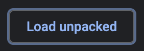

#  Warpcast PFP Animator: Chrome Extension


[🚀 Download the latest release on Chrome Web Store 🚀](https://chrome.google.com/webstore/detail/dungeons-status/mhanemmhefbbdgoliknpiomibaglkdni/)

---

A Manifest V3 Chrome Extension which automatically changes the `img` elements' `src` attributes on `warpcast.com` to animate profile pictures (PFPs). The extension observes changes in the DOM to ensure newly added images are also updated accordingly, enhancing the user experience by ensuring profile pictures (PFPs) are consistently animated.

### Required Permissions:

-   `host_permissions`: To interact with `https://warpcast.com/*`.

## Installation

0.  Clone this repo to your local machine

```
git clone https://github.com/skullzarmy/warpcast-pfp-animator.git
```

or [download .zip](https://github.com/skullzarmy/warpcast-pfp-animator/archive/refs/heads/main.zip)

1.  Open your browser's extensions page:

    -   **Chrome**: Navigate to `chrome://extensions` by typing it into the address bar and hitting enter.
    -   **Firefox**: Navigate to `about:debugging` by typing it into the address bar and hitting enter.
    -   **Edge**: Navigate to `edge://extensions` by typing it into the address bar and hitting enter.

2.  Enable "Developer mode":

    -   **Chrome**: At the top right [↗] of the page, toggle on "Developer mode". This will enable additional options for loading custom extensions.
    -   **Firefox**: Click on "This Firefox" in the sidebar, then click on "Load Temporary Add-on" and select the `manifest.json` file.
    -   **Edge**: At the top right [↗] of the page, toggle on "Developer mode". This will enable additional options for loading custom extensions.

    

3.  Load the extension:

    -   **Chrome/Edge**: At the top left [↖] of the page, click on the "Load unpacked" button that appears once you have enabled developer mode. A file selection dialog will appear. Navigate to the directory where you cloned the repo, and select the directory.
    -   **Firefox**: Click on "Load Temporary Add-on", navigate to the directory where you cloned the repo, and select the `manifest.json` file.

    

The extension should now appear in your list of extensions and be available for use. You should see its icon [  ] in the extensions section of the browser toolbar. If the icon doesn't appear, you may need to click on the Extensions icon (which looks like a puzzle piece) in the browser toolbar and pin your extension so that its icon is always visible.

If you download a new version, first replace the files in the extension directory with the new versions, then you can click the "Reload" button on your extension's box in the extensions page to load in the changes.

Remember, your extension will only be available in the current profile and on the current device where you loaded it. If you sign in to a different profile, or use a different device, you'll need to load the extension again.

## Creating an Issue

If you encounter any problems or have suggestions for improvements, please create an issue on the GitHub repository. To create an issue:

1. Go to the [GitHub issues page](https://github.com/skullzarmy/warpcast-pfp-animator/issues).
2. Click on the "New issue" button.
3. Provide a descriptive title and detailed description of the issue.
4. If possible, include steps to reproduce the problem.
5. Add any relevant screenshots or error messages.
6. Click "Submit new issue".

I appreciate your feedback and will do my best to address any issues promptly.

## LICENSE

MIT License

Copyright (c) 2024 [skllzrmy](https://skllzrmy.com/) [Joe Peterson](https://joepeterson.work)

[LICENSE FILE](LICENSE)

---

### Acknowledgements

This project was inspired by the extension created by [ggomaeng](https://github.com/ggomaeng) (GitHub profile: [https://github.com/ggomaeng/warpcast-chrome-extension](https://github.com/ggomaeng/warpcast-chrome-extension)), but all code in this project was written by [skllzrmy](https://skllzrmy.com/).
